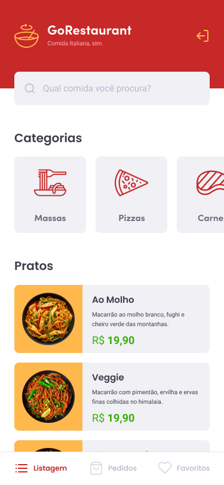

# GoRestaurant

Mobile Application for restaurant management

## ✋🏻 Prerequisites

- [Node.js](https://nodejs.org/en/)
- [Yarn](https://yarnpkg.com/pt-BR/docs/install)
- [Expo](https://expo.io)

## Layout

<div style="display: flex; justify-content:space-between;">
<p style="text-align: center">
  
<p>
<p style="text-align: center">
  
<p>
<p style="text-align: center">
  
<p>
</div>

## Installation

Clone the repository, and install the dependencies by running the following commands:

```sh
  $ git clone https://github.com/jmamadeu/gorestaurant.git
```

```sh
  $ cd gorestaurant
```

```sh
  $ yarn  # or npm install
```

```sh
  $ yarn start # or npm run start #or expo start
```

### For running the api

OBS: Go to the file `package.json` into script `api` change the `IP Address` to you IP Address.

## Contribution

Contributions are what make the open source community an incredible place to learn, inspire and create. Any contribution you make will be ** very valuable and appreciated **.

1. Fork the project
2. Create a Branch for your Feature (`git checkout -b feature/IncredibleFeature`)
3. Add your changes (`git add .`)
4. Commit your changes (`git commit -m 'Adding an awesome Feature!`)
5. Push the Branch (`git push origin feature/FeatureIncrivel`)
6. Open a Pull Request

## Author

### João Amadeu

- [Linkedin](https://www.linkedin.com/in/jo%C3%A3o-amadeu-8812291a5/)
